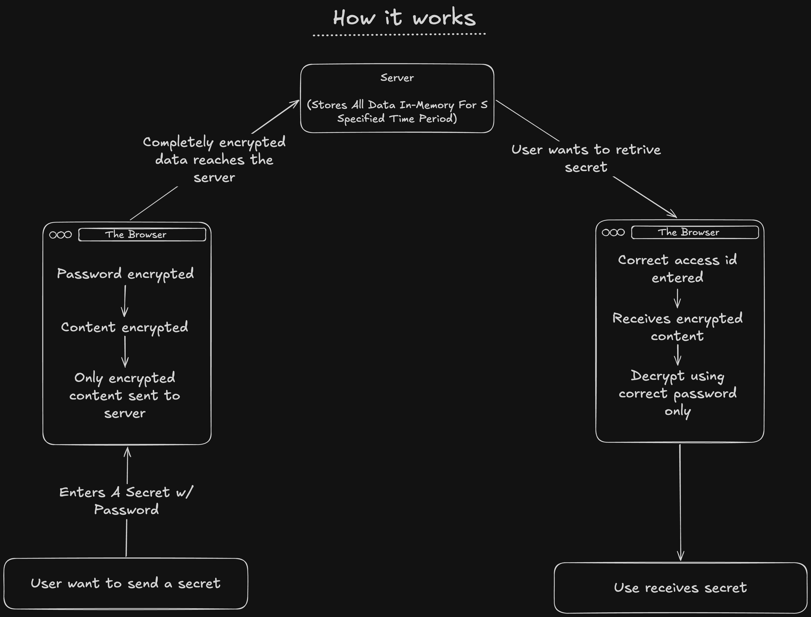

# Secret Sharer
This is a very simple & lightweight secret sharing tool focused on maximum security when sharing secrets.

### Contents
[What's the purpose?](#whats-the-purpose)  
[Why should I use this?](#why-should-i-use-this)  
[Self hosting](#self-hosting)  
[Things to keep in mind](#things-to-keep-in-mind)  
[Tech Stack](#tech-stack)  

## What's the purpose?
Until now I haven't found a reliable way to share secrets like passwords, environment variables, 2FA backup codes, etc. There's always a big concern of privacy that your secrets may get leaked. Big tech has been logging everything, even a CTRL + V that you do. Tired of all this, I decided to create my own very secure secret sharing tool that I can use to share secrets to anyone extremely trustingly & reliably.

## Why should I use this?

This tool uses various techniques to safegard your data like:
- Zero knowledge encryption: The server has no clue about your decryption key.
- Multi layer encryption: Password itself is encrypted before encrypting the content with it. This makes brute forcing practically impossible.
- Zero knowledge about content: The server doesn't know what you're storing.
- Zero persistent storage: No data is stored persistent. All data is stored in memory protecting from hypervisor level attacks.
- Extremely lightweight: Can be used easily even on a 512MB RAM server!
- Zero config: There is no configuration required at all to run this. No environment variables, no cli arguments, nothing!
- No 3rd party stuff: There is no 3rd party dependencies on the server which improves security massively from supply-chain attacks.
- Operations happen client-side: All the encryption and decryption happens client-side. This improves security massively since no one can read your secret during transmission to the server.

TLDR; Everything is stored in the memory in an encrypted form. This means that even if somehow (almost impossible) if your memory is dumped at a physical/administrator level, your data is still practically impossible to crack due to the sheer amount of encryption layers and algorithms. Along with that, this tool is absolutely simple to setup as well as it doesn't require any configuration.

## Self hosting
NOTE: When self hosting keep in mind that once the server stops, all data is lost. This means that if suppose you make an update, all data shall be lost to blank. This is because no persistent storage is used.

### Binary (Recommended)
This is the easiest & most optimized way to use this tool. This doesn't require anything to be installed beforehand. All you need is to head over to the release section, download the binary that suits your platform & run it.

### Bun
Requirement: Git, Bun
```
git clone https://github.com/sancho1952007/secret-sharer
cd secret-sharer
bun install --production
bun index.ts
```

### Docker
A Dockerfile has been included to run this tool on Docker.


## Things to keep in mind
- There is a rate limit of 10 requests per minute (only for POST requests i.e. creating or accessing a secret) crossing which would ban your IP for 24 hours.


## Tech Stack
I've choosen an extremely simple tech stack for this project.
Frontend: HTML, CSS, JS
Backend: Bun

There are no 3rd party dependencies used in the backend. For the frontend, I used 2 3rd party dependencies.
1. Bunny fonts for font.
2. Qrcode.js to generate the QR code on the create page.

Rest assured, these are two very popular and secure dependencies.